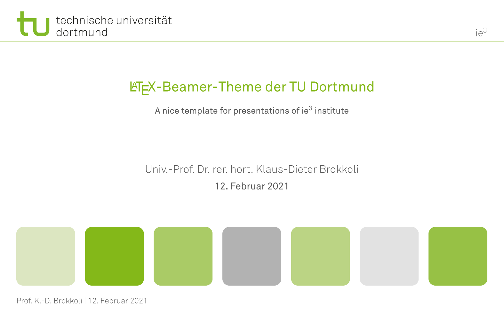

# LaTeX Beamer Theme for the TU Dortmund, Germany




It follows the Corporate Design of the Powerpoint Templates the TU Dortmund supplies.

Feel free to use it. License is BEERWARE.

To install this into your local TeXLive System so you can use it anywhere without copying file, use:
```
$ git clone https://github.com/ie3-institute/tudobeamertheme $(kpsewhich --var-value TEXMFHOME)/tex/latex/tudobeamertheme
```

Aforementioned command typically doesn't work on MikTeX systems.
Therefore, locate the proper path, e.g. from MikTeX Console GuI and adapt the following line:
```
$ git clone https://github.com/ie3-institute/tudobeamertheme "c:/Program Files/MikTeX/tex/latex/tudobeamertheme"
```
Afterwards, you need to refresh the filename database (via MikTeX Console).

## Prerequisites
### Fonts
If you intend to compile with LuaLaTeX or XeTeX, your system requires to have some fonts installed.
Either this is Akkurat Light Office and Akkurat Office or [Fira Sans](https://github.com/bBoxType/FiraSans).
[Fira Sans Math](https://github.com/firamath/firamath) and [Fira Mono](https://bboxtype.com/typefaces/FiraMono) are definately needed.

### Pictures
The template includes pictures on demand.
E.g. the first, third, fifth and seventh box on the title slide can be replaced by pictures.
This is activated by the existence of `images/tudo-title-1.jpg` to `images/tudo-title-4.jpg`.
If the files are missing, green boxes are placed instead.

Same applies for the logo of your chair.
If there is `logos/chair.pdf` available, it will be place in the top right corner of each slide.
Otherwise a text _Acronym Chair_, given with `\institute[Acronym Chair]{Long Title of Chair}` is placed.
